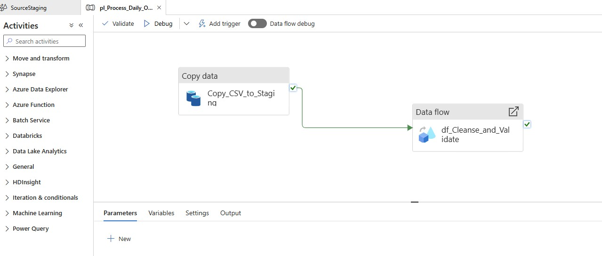
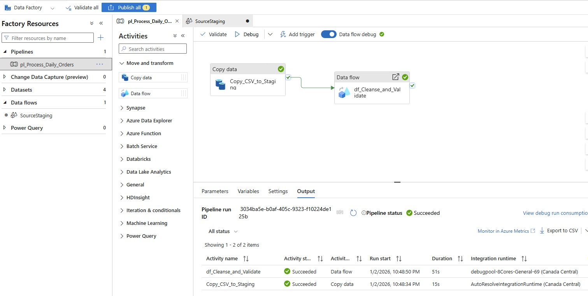
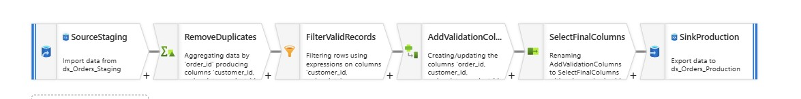
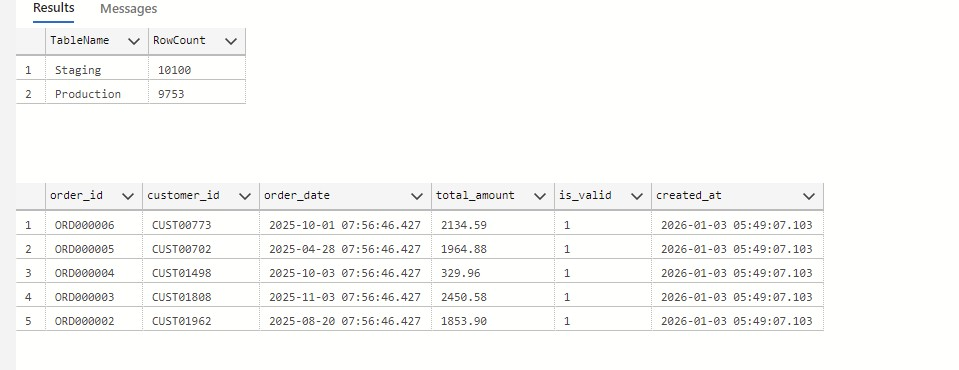

# E-Commerce Order Processing Pipeline

## Business Problem
Process daily order files from an e-commerce platform, validate data quality, and load clean data into a SQL database for reporting and analytics.

## Solution Architecture

### High-Level Design
```
CSV Files (Blob Storage) 
    → Copy Activity (ADF) 
    → Staging Table (SQL) 
    → Data Flow Transformations (ADF) 
    → Production Table (SQL)
```

### Technology Stack
- **Orchestration:** Azure Data Factory
- **Storage:** Azure Blob Storage (raw files), Azure SQL Database (processed data)
- **Transformations:** ADF Data Flows (visual ETL)
- **Monitoring:** ADF Pipeline Monitoring, SQL metrics tables

## Pipeline Components

### 1. Data Ingestion
- **Source:** Daily CSV files in Azure Blob Storage
- **Pattern:** Partitioned by date (YYYY/MM/DD/)
- **Activity:** Copy Data activity with fault tolerance

### 2. Data Transformations (6-Step Data Flow)

**Transformation Flow:**
1. **SourceStaging** - Read from staging table
2. **RemoveDuplicates** - Aggregate by order_id, keep first occurrence
3. **FilterValidRecords** - Remove NULL customer_ids and future dates
4. **AddValidationColumns** - Add is_valid, created_at, updated_at
5. **SelectFinalColumns** - Select only required columns
6. **SinkProduction** - Load to production table

### 3. Data Quality Rules
- ✅ Remove duplicate order_ids
- ✅ Reject orders with missing customer_id
- ✅ Reject orders with future dates
- ✅ Validate data types and format

## Results

### Pipeline Execution Metrics
```
Total Records Processed:    10,100
Valid Records Loaded:        9,753
Invalid Records Rejected:      347
Data Quality Success Rate:   96.6%
Average Execution Time:      ~90 seconds
```

### Data Quality Impact
- **Duplicates Removed:** ~100 records (1.0%)
- **Missing Data Filtered:** ~200 records (2.0%)
- **Invalid Dates Filtered:** ~50 records (0.5%)

## Database Schema

### Staging Table (Orders_Staging)
- Accepts all data (no constraints)
- Includes load_timestamp for tracking
- Acts as landing zone before validation

### Production Table (Orders)
- Primary key on order_id (prevents duplicates)
- NOT NULL constraints on critical fields
- Audit columns (created_at, updated_at)
- is_valid flag for tracking

### Error Tracking (Orders_Errors)
- Captures rejected records
- Stores error reasons
- Enables data quality monitoring

### Metrics Tracking (Pipeline_Metrics)
- Tracks every pipeline run
- Records row counts and execution time
- Enables SLA monitoring

## Key Learnings

### Technical Skills
- Azure Data Factory pipeline orchestration
- Data Flow visual transformations
- Staging pattern implementation
- Data quality validation logic
- Azure SQL Database design
- Pipeline monitoring and observability

### Best Practices Implemented
- **Never load directly to production** - Always use staging
- **Track everything** - Metrics for every run
- **Fail gracefully** - Error tables for rejected records
- **Audit trails** - created_at/updated_at timestamps
- **Idempotent pipelines** - Can safely re-run

## Future Enhancements
- [ ] Incremental loading (only process new/changed records)
- [ ] Email alerts on pipeline failures
- [ ] Parameterized file paths for dynamic dates
- [ ] Data lineage tracking
- [ ] Performance optimization for larger datasets
- [ ] CI/CD deployment automation

## Screenshots

### Pipeline Overview


### Successful Execution


### Data Flow Transformations


### SQL Results


## How to Run

### Prerequisites
- Azure subscription
- Azure Data Factory instance
- Azure SQL Database
- Azure Blob Storage account

### Setup Steps
1. Create Azure resources (Storage, ADF, SQL Database)
2. Upload sample data to Blob Storage (2026/01/02/ folder)
3. Create SQL tables using provided scripts
4. Import ADF pipeline JSON
5. Configure linked services with your credentials
6. Run Debug to test

### Sample Data Generation
Use the Python script in `/scripts/generate_orders.py` to create realistic test data.
```bash
python scripts/generate_orders.py
```

## Project Timeline
**Duration:** 2 days  
**Completion Date:** January 3, 2026

---

**Author:** Chuka  
**Role:** Data Engineer 
**Contact:** chuka.nwakanma@gmail.com
