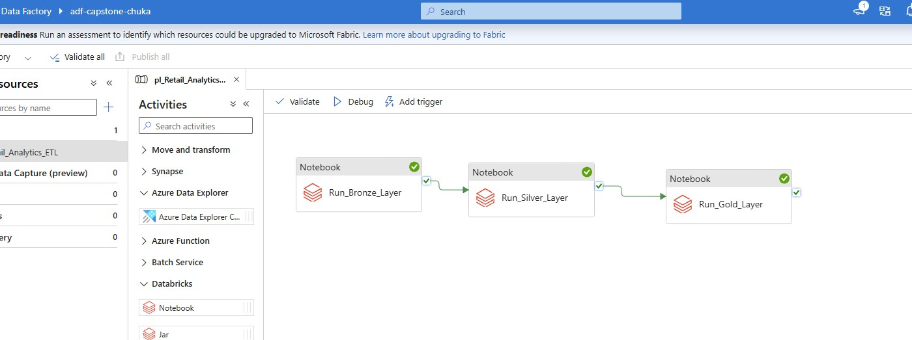
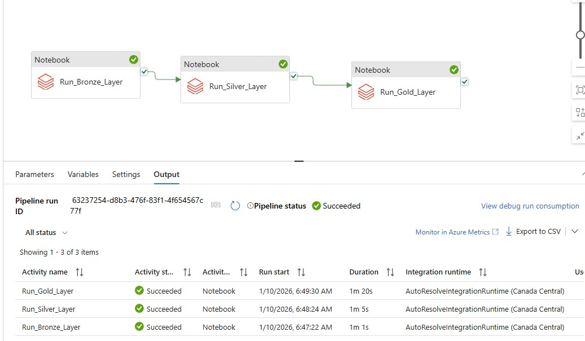
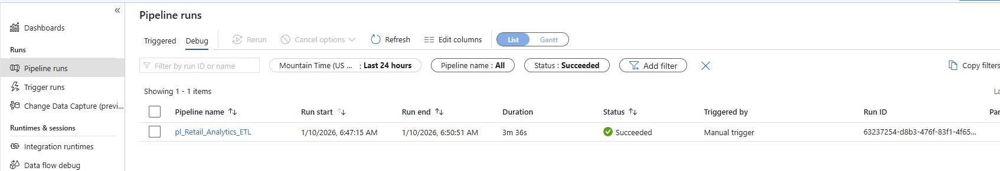

# Retail Analytics Data Platform

**End-to-End Azure Data Engineering Solution with Medallion Architecture**

## Project Overview

Complete data lakehouse platform processing 15,000+ retail transactions using **Azure Data Factory**, **Azure Databricks**, and **Delta Lake** with medallion architecture (Bronze/Silver/Gold layers).

**Built by:** Chuka Nwakanma
**Date:** January 2026  
**Technologies:** Azure Data Factory, Azure Databricks, Delta Lake, PySpark, Azure Blob Storage

---

## Architecture

```
CSV Files → ADF Pipeline → Databricks (Bronze → Silver → Gold) → Delta Lake Tables
```

**Components:**

- **Data Source:** CSV files (sales, products, customers)
- **Ingestion:** Azure Blob Storage
- **Orchestration:** Azure Data Factory pipeline
- **Processing:** Azure Databricks (PySpark)
- **Storage:** Delta Lake (ACID transactions)
- **Output:** 9 production-ready analytical tables

---

## Data Flow

### **Bronze Layer (Raw Data Preservation)**

- **Purpose:** Exact copy of source data with audit metadata
- **Tables:** 3 (sales, products, customers)
- **Features:**
  - Immutable raw data
  - Ingestion timestamps
  - Source file tracking
  - Full history for reprocessing

### **Silver Layer (Cleaned & Enriched)**

- **Purpose:** High-quality, business-ready data
- **Tables:** 1 (sales_enriched)
- **Transformations:**
  - Deduplication using PySpark window functions
  - Data quality validation (96%+ clean rate)
  - Multi-table joins (sales + products + customers)
  - Calculated metrics (revenue, profit margin)
  - Date parsing and enrichment
- **Data Quality:** 98%+ accuracy after validation

### **Gold Layer (Business Analytics)**

- **Purpose:** Pre-aggregated tables for BI/reporting
- **Tables:** 5 analytical tables
  1. **Daily Sales Summary** - Revenue trends by date/region/category
  2. **Product Performance** - Rankings, revenue, units sold
  3. **Customer Segments** - Lifetime value, RFM analysis
  4. **Regional Analysis** - Geographic performance metrics
  5. **Executive KPI** - Key business metrics dashboard

---

## Technologies & Skills

**Azure Services:**

- Azure Data Factory (Orchestration)
- Azure Databricks (Processing)
- Azure Blob Storage (Data Lake)
- Delta Lake (ACID Transactions)

**Programming & Tools:**

- PySpark (Data Transformations)
- SQL (Data Queries)
- Python (Scripting)

**Concepts Demonstrated:**

- Medallion Architecture (Bronze/Silver/Gold)
- ETL/ELT Pipeline Design
- Data Quality Frameworks
- Incremental Loading Patterns
- ACID Transactions
- Time Travel & Audit Compliance
- Partitioning for Performance
- Pipeline Orchestration

---

## Key Metrics

| Metric                      | Value                   |
| --------------------------- | ----------------------- |
| **Total Records Processed** | 15,000+ transactions    |
| **Data Quality Rate**       | 98%+ clean data         |
| **Processing Time**         | < 10 minutes end-to-end |
| **Tables Created**          | 9 Delta tables          |
| **Storage Format**          | Parquet (compressed)    |
| **Data Partitioning**       | By transaction_date     |

**Scheduling:** Can be triggered manually or scheduled (daily/hourly)

---

## Screenshots

### Pipeline Design


_Azure Data Factory pipeline orchestrating Databricks notebooks_

### Successful Execution


_All activities completed successfully_

### Monitoring Dashboard


_Pipeline run monitoring and metrics_

---

## Key Features

✅ **Complete Medallion Architecture** - Industry-standard data lakehouse pattern  
✅ **Data Quality Validation** - Multi-layered validation ensuring 98%+ accuracy  
✅ **ACID Transactions** - Delta Lake ensures data consistency  
✅ **Time Travel** - Query historical versions for audit compliance  
✅ **Automated Orchestration** - ADF pipeline handles dependencies  
✅ **Scalable Design** - Can process millions of records  
✅ **Production Ready** - Error handling, logging, monitoring

---

## Skills Demonstrated

**Data Architecture:**

- Designed medallion architecture (Bronze/Silver/Gold)
- Implemented lakehouse pattern with Delta Lake
- Created star schema for analytics

**Data Engineering:**

- Built ETL pipelines with Azure Data Factory
- PySpark transformations for large-scale data processing
- Data quality frameworks and validation logic
- Incremental loading and change data capture patterns

**Cloud Platforms:**

- Azure Data Factory for orchestration
- Azure Databricks for distributed computing
- Azure Blob Storage for data lake
- Resource management and cost optimization

**Data Quality:**

- Deduplication strategies
- Null handling and validation rules
- Data profiling and anomaly detection
- Clean data rate: 98%+

---

## How to Run

### Prerequisites

- Azure subscription
- Azure Data Factory
- Azure Databricks workspace
- Azure Blob Storage account

### Execution Steps

1. Upload CSV files to Azure Blob Storage
2. Configure linked services in ADF
3. Trigger pipeline
4. Monitor execution in ADF Studio
5. Query Gold tables via Databricks SQL or connect BI tools

---

## Business Value

**For Data Analysts:**

- Pre-aggregated Gold tables for fast queries
- Clean, validated data (98%+ quality)
- Clear data lineage and documentation

**For Business Users:**

- Self-service analytics via BI tools
- Real-time insights into sales performance
- Customer segmentation for marketing

**For Data Engineers:**

- Scalable, maintainable architecture
- Automated data pipelines
- Easy to extend with new data sources

---

## Connect With Me

- **LinkedIn:** [[Chuka Nwakanma](https://www.linkedin.com/in/chukwuka-nwakanma-1043a136/)]
- **Email:** [chuka.nwakanma@gmail.com]

---

## License

This project is for portfolio demonstration purposes.

---

## Data Disclaimer

**This is a demonstration project using synthetic data.**

- **Data Source:** AI-generated sample data
- **Purpose:** Portfolio demonstration and technical showcase
- **Authenticity:** Not real business data
- **Privacy:** No actual customer information

The data structure, transformations, and analytical outputs represent real-world patterns and demonstrate production-ready data engineering capabilities.

_This documentation was drafted with AI assistance. All architecture decisions, code, and implementation are my own work._
