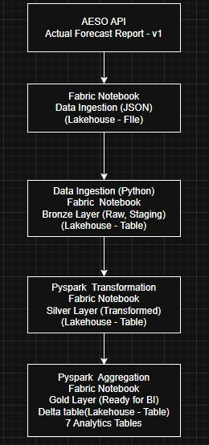

# AESO Grid Analysis

**An end-to-end analytics platform processing real-time electricity grid data from AESO, implementing data engineering patterns with Microsoft Fabric and Power BI. **

## Project Overview

Complete data engineering solution that ingests, transforms, and analyzes Alberta's electricity load data, providing real-time monitoring and forecast accuracy analysis for grid operations.

**Built by:** Chuka Nwakanma
**Date:** January 2026  
**Technologies:** Azure Data Factory, Azure Databricks, Delta Lake, PySpark, Azure Blob Storage

---

## Architecture

```
API → Notebook → Micrsofot Fabric Lakehouse (Bronze → Silver → Gold) → Delta Lake Tables (Power BI)
```

**Components:**

- **Data Source:** AESO Actual Forecast Report - v1
- **Ingestion:** Notebook Fabric Lakehouse → FIle (Staging)
- **Processing:** Notebook Fabric Lakehouse → Table (Bronze, Silver, Gold)
- **Storage:** Onelake Catalog
- **Output:** 8 analytical tables (7 gold table, 1 silver table for real-time analysis)

---

## Data Flow

### **Bronze Layer (Raw Data Preservation)**

1. HTTP GET to AESO API with date parameters
2. JSON response validation
3. Save raw JSON to `/Files/bronze_raw/`
4. Parse and write to `bronze_aeso_load` Delta table
5. Add metadata: ingestion_timestamp, api_response_code

### **Silver Layer (Transformed)**

- **Purpose:** High-quality, business-ready data
- **Tables:** 1 (sales_enriched)
- **Transformations:**
- Parse timestamps (UTC and Mountain Prevailing Time)
- Type conversion (string → integer for load values)
- Calculate forecast_error_mw = actual - forecast
- Calculate forecast_error_pct = (error / forecast) \* 100
- Extract time features: hour, day_of_week, is_weekend
- Data quality: remove nulls, deduplicate by timestamp

**Output:** `silver_aeso_load` Delta table

### **Gold Layer (Analytics)**

- **Purpose:** Pre-aggregated tables for BI/reporting
- **Tables:** 7 analytical tables

1. **gold_daily_load_summary:** Daily statistics
2. **gold_peak_demand:** Peak hour per day
3. **gold_hourly_patterns:** Average load by hour
4. **gold_hourly_patterns_weekends:** Average load by hour weekends
5. **gold_forecast_accuracy_hourly\*:** Accuracy metrics hourly
6. **gold_forecast_accuracy_daily\*:** Accuracy metrics daily
7. **gold_forecast_accuracy_overall\*:** Accuracy metrics overall

### **Visualization Layer**

**Purpose:** Business intelligence and monitoring

**Components:**

- Power BI Desktop for development
- Direct Lake mode for real-time queries
- 5 dashboard pages: Monitor, Daily, Peak, Patterns, Accuracy

---

## Technologies & Skills

**Microsoft Fabric:**

- Notebook (Processing)
- Lakehouse (Delta Table)
- Onelake Catalog (Data Lake)
- Pipeline (Orchestration, Refresh Schedule)

**Programming & Tools:**

- PySpark (Data Transformations)
- Python (Scripting)

**Concepts Demonstrated:**

- Medallion Architecture (Bronze/Silver/Gold)
- ETL/ELT Pipeline Design
- Data Quality Frameworks
- ACID Transactions
- Pipeline Orchestration

---

**Scheduling:** is triggered daily

---

### Report


## Screenshots

### Pipeline Design



---

## Connect With Me

- **LinkedIn:** [[Chuka Nwakanma](https://www.linkedin.com/in/chukwuka-nwakanma-1043a136/)]
- **Email:** [chuka.nwakanma@gmail.com]

---

## License

This project is for portfolio demonstration purposes.

---

## Data Disclaimer

This report uses data from the AESO Public API. Information may change over time, and accuracy or completeness is not guaranteed. Use this report for general reference only and verify important details with official AESO sources.

_This documentation was drafted with AI assistance. All architecture decisions, code, and implementation are my own work._
