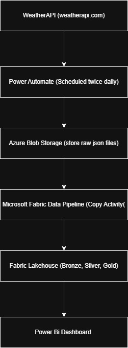
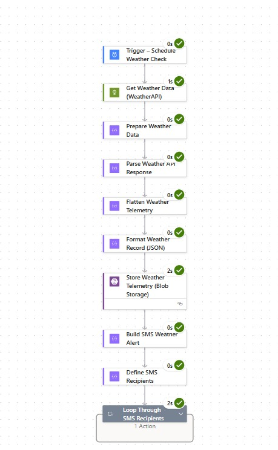
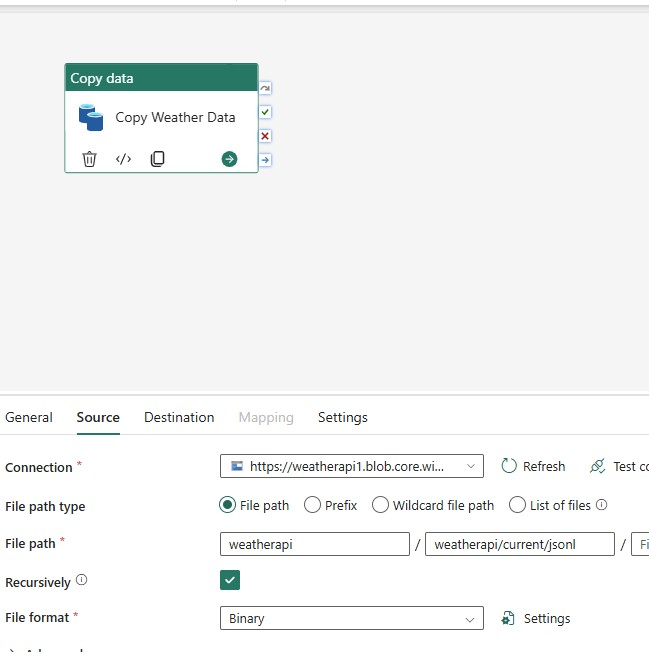

# Calgary Weather Analytics Pipeline

**An end-to-end analytics platform processing Calgary weather data from WeatherAPI, implementing automation and data engineering patterns with Microsoft Power Automate, Microsoft Fabric and Power BI. **

## Project Overview

This project started with a simple problem: my wife needed reliable weather information each morning to decide what our son should wear to daycare. Instead of checking a weather app, I automated the data collection and built a platform to store and analyze the data over time.

**Built by:** Chuka Nwakanma
**Date:** Feburary 2026  
**Technologies:** WeatherAPI, Power Automate, Azure Blob Storage, Microsoft Fabric, PySpark, Delta Lake, Power BI

---

## Architecture

**Components:**

- **Data Source:** Weather API via a Scheduled Power Automate Flow
- **Ingestion:** Fabric Data Pipeline → Lakehouse → FIle (Staging)
- **Processing:** Notebook Fabric Lakehouse → Delta Table (Bronze, Silver, Gold)
- **Storage:** Onelake Catalog, Azure Blob
- **Output:** 4 analytical tables (3 gold table, 1 silver table)

---

## Data Flow

### **Bronze Layer (Raw Data Preservation, Data pipeline and Notebook)**

1. Use Copy data activity to get data from Azure Blob into Lakehouse
2. Configured the Source and Destination
3. Save raw JSON to `/Files/weather_data/`
4. write raw json to `bronze_weather_data` Delta table

### **Silver Layer (Transformed)**

- **Purpose:** High-quality, business-ready data
- **Transformations:**
- flattening structured fields from raw json
- calculate comfortindex = humidity + temperature_c
- created columns for date, month, year, day and hour of day from localtime using pyspark functions
- created an is_weekend column of type boolean

**Output:** `silver_weather_data` Delta table

### **Gold Layer (Analytics)**

- **Purpose:** Pre-aggregated tables for BI/reporting
- **Tables:** 3 analytical tables

1. **gold_daily_summary:** Daily overview
2. **gold_weekly_summary:** Weekly overview
3. **gold_monthly_summary:** Monthly overview

### **Visualization Layer**

**Purpose:** Business intelligence and monitoring

**Components:**

- Power BI Desktop for development
- Direct Lake mode for real-time queries
- For now, there will be two dashboard pages: Daily and Weekly Overview. I’m planning to add a Monthly page once we have more monthly data—most likely toward the end of the second quarter.

---

## Technologies & Skills

**Microsoft Power Platform:**

- Power Automate (Automate data retrieval and load into Data Lake)

**Microsoft Fabric:**

- Notebook (Processing)
- Lakehouse (Delta Table)
- Onelake Catalog (Data Lake)
- Pipeline (Orchestration, Refresh Schedule)

**Programming & Tools:**

- PySpark (Data Transformations)
- Python (Scripting)

**Concepts Demonstrated:**

- Medallion Architecture (Bronze/Silver/Gold)
- ETL/ELT Pipeline Design
- Data Quality Frameworks
- ACID Transactions
- Pipeline Orchestration

---

**Scheduling:**

- Power Automate is triggered twice daily
- Data Pipeline is triggered once daily

---

## Screenshots

### Codes

### Report

---

## Connect With Me

- **LinkedIn:** [[Chuka Nwakanma](https://www.linkedin.com/in/chukwuka-nwakanma-1043a136/)]
- **Email:** [chuka.nwakanma@gmail.com]

---

## License

This project is for portfolio demonstration purposes.

---

## Data Disclaimer

This report uses data from the Weather Public API. Information may change over time, and accuracy or completeness is not guaranteed. Use this report for general reference only.

_This documentation was drafted with AI assistance. All architecture decisions, code, and implementation are my own work._
